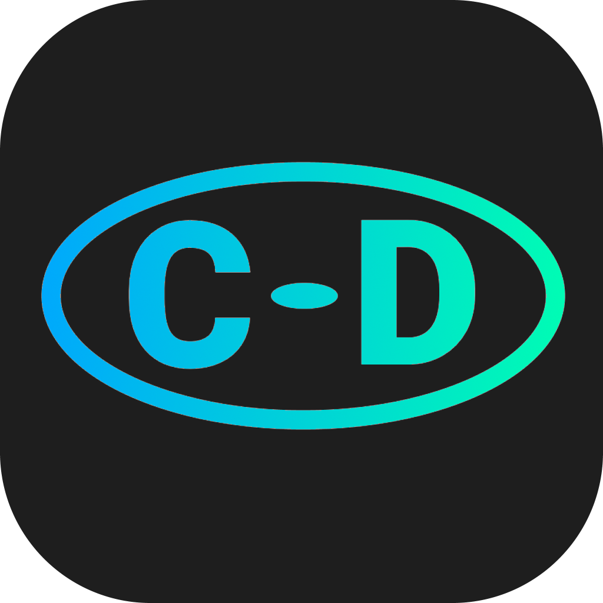

# Codename Delta

 
<h3>Latest version: v0.2.1-dev1</h3>

## How to use

#### To run this bot, you must have a executor which is something like <a href="https://krnl.ca">krnl</a> or <a href="https://oxygenu.xyz">Oxygen U</a> or just pack it into a local script if your using this in a game not a exploit. (not recommended as it can make all players have bot)

#### Once you have the executor, open the script in it and execute it!

###### (unless you put it in a game, then u can just run the game and it will happen)

## How to help with development

#### If you want to help with the development of the bot, <a href="https://github.com/jwklong/Codename-Delta/issues">report issues</a> on GitHub so we can fix them quicker.

#### If you want to add commands to the bot, do a <a href="https://github.com/jwklong/Codename-Delta/pulls">pull request</a> and we will view your changes.

###### <a href="https://github.com/jwklong/Codename-Delta/tree/v0.2.x-dev">development branch</a>
